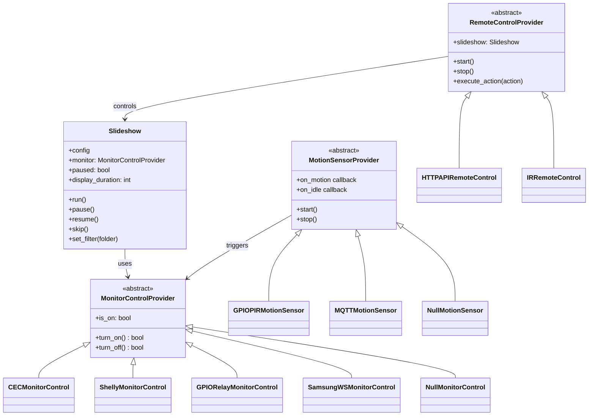

# AIDE - Slideshow

A modular fullscreen photo slideshow with a plugin architecture for different hardware setups.

Designed to run on a dedicated device connected to a wall mounted display as a digital photo frame.

This project is part of [AIDE examples](https://github.com/aide-examples) - a series of applications built almost completely with agentic coding.

---

# Platform

## Target Device Selection

We are looking for a cheap platform which can store a lot of images and display them via HDMI.
It must be strong enough to host a small web server, so that we conveniently can upload images
and control the device via a mobile phone. Furthermore the device should be small and energy efficient.
It must allow to connect sensors for motion and darkness because we want to switch the system
off when no human is around. Ideally we want to adapt brightness depending on ambient light.
Maybe we also want to power on/off the display to save energy.

An ESP32 based system would be too weak, even if we had a storage card connected. So the natural
choice is a Raspberry. We aim to use the Rpi Zero 2WH because it has everything we need:
A multitasking OS, HDMI output and USB ports, GPIOs (to connect a motion sensor) and an SD card
which will be able to store thousands of images. However, there is not much memory (512 MB RAM).

The original idea was to run a chromium browser page in kiosk mode. Hardware access might be 
somewhat problematic, however, and we would need to install the full desktop OS to run the browser.
Tests showed that it could work on an old Raspi 3B (similar processor as 2WH but 1024 MB of memory)
but sometimes the screen was not refreshed properly, most probably due to memory bottlenecks.

So the choice went for a python script which draws directly into the grahical memory using
pygame and a suitable driver (vc4-kms-v3d). If we are carefully setting the limits for the GPU
we will have sufficient memory for the python process - which must not only read images but shall
also handle a Web API and optionally be able to take commands from a classical infrared remote control.

As is often the case with developing systems for tiny target hardware we aim at being able to test the 
application within the development environment (windows/wsl ubuntu). Therefore we added hardware
detection and bypassing for the raspi-specific libraries. Hardware sensors are replaced by stubs.

Because this application is part of the *[aide-examples](https://github.com/aide-examples)* we also 
want to offer easy access to the current document. So we included an "about.html" which allows viewing
markdown files and mermaid diagrams on the web client of the application.


## Task Assignment

We see the following tasks and plan to assign them to the platforms as follows

- sliding the images, controlling HDMI
  - Python script on RPI ZWH in production
  - WSL/Ubuntu in development

- UI to control the slider
  - Python script serves tiny index.html on port 8080 with embedded css and js
  - Web client browser on user's platform (desktop, tablet, mobile) handles the UI

- display information on architecture of the system
  - Python script serves "about.html" and README.md
  - Web client browser on user's platform handles UI, fetches README and renders markdown

- administration of images
  - we install a separate executable on the target hardware ("filebrowser")
    which comes with its own http server (port 8081)
  - during development we use the native explorer of the IDE platform
  - the control UI (port 8080) contains a href to the filebrowser UI (port 8081)

- searching images, taking photos
  - done by the user on a platform of his choice
  - maybe we can provide an AI assistant which identifies and collect suitable material?
  - upload via the filebrowser wen frontend

- preparation of images for efficient display
  - this could be a separate application running on the user's machine before uploading;
    maybe it is another python script which we provide
  - or it could be integrated into the sliding app after uploading if memory restrictions
    and CPU power allow; this solution would avoid the need to have a python environment
    on the user's machine
  - technically the preparation may include the user of tools like image-magick or ffmpeg
  
---

# Requirements

This is a long list of potential features. Those marked with an asterisk are already implented.

- show images
  - in random order (*)
  - in canonical order by name or timestamp
  - show all images or only a subset (*)
  - restrict shown images to those matching a certain monitor orientation (portrait/landscape)
  - recognize current monitor orientation (tilt sensor)
  - show image exactly if it meets the monitor resolution (*)
  - image preparation (may or may not happen within the slide showing process)
    - adapt image size cleverly if it does not meet size or proportions
    - allow some degree of distortion
    - add border in color which harmoizes with image content
    - add image file name in decent small gray font
    - prepare images to be shown in landscape mode even when they have portrait format
    - prepare images to be shown in portrait mode even when they have landscape format
    - offer art style borders/frames and integrate into the image

- energy
  - run on an energy efficient device (*)
  - switch the monitor off when no images shall be shown (*)
  - react on motion detection
  - allow time dependant on/off periods
  - allow daylight dependant on/off periods
  - adapt brightness to ambient light conditions

- control (how)
  - via mouse
  - via keyboard
  - via a REST API (*)
  - via an HTTP UI (*)
  - via an infrared remote control

- control (what)
  - play (*)
  - pause (*)
  - forward/skip (*)
  - backward
  - presentation order
  - select image subdirectory as a subset for presentation (*)
  - presentation speed (*)
  - select type of image change (slide, fade, ..)
  - monitor on/off via CEC (*)
  - monitor on/off via relay (AC power)
  - monitor on/off via shelly plug

- image administration
  - sftp access to image directory (*)
  - batch upload via API
  - interactive upload via a web client (*) - installed "filebrowser" executable

- documentation
  - architecture documentation in README.md (*)
  - being able to show this documentation when the app is running (*)

---

# Architecture Overview (Python Source)

The script is built around three main concerns, each with multiple implementation options (providers):

| Concern | Problem | Providers |
|---------|---------|-----------|
| **Monitor Control** | Turn display on/off to save power | CEC, Shelly, GPIO Relay, Samsung WS |
| **Motion Detection** | Detect presence to auto-wake display | GPIO PIR, MQTT |
| **Remote Control** | Control slideshow playback | HTTP API, IR Remote |

Each concern has an abstract interface. You choose ONE provider per concern (except Remote Control, where you can enable multiple). Switch providers by changing the `provider` field in `config.json`.



---

## 1. Monitor Control

**Problem:** We need to turn the display on/off automatically (to save power when nobody is watching) or manually (via remote control).

### Available Providers

#### CEC (Default) - `"provider": "cec"`
Uses HDMI-CEC protocol to control the TV.

| Aspect | Details |
|--------|---------|
| **Requirements** | `cec-utils` package, TV with CEC support |
| **Hardware cost** | None (uses HDMI cable) |
| **Advantages** | No extra hardware, proper standby mode |
| **Limitations** | Some TVs have buggy CEC, may not work with HDMI switches |
| **Samsung name** | "Anynet+" - enable in Settings → General → External Device Manager |

```json
"monitor_control": {
    "provider": "cec",
    "cec": {
        "device_id": "0"
    }
}
```

**Test CEC:**
```bash
sudo apt install cec-utils
echo "scan" | cec-client -s -d 1      # Scan for devices
echo "standby 0" | cec-client -s -d 1  # Turn TV off
echo "on 0" | cec-client -s -d 1       # Turn TV on
```

#### Shelly Smart Plug - `"provider": "shelly"`
Uses a Shelly smart plug to cut power to the display.

| Aspect | Details |
|--------|---------|
| **Requirements** | Shelly Plug/Shelly 1, same network as Pi |
| **Hardware cost** | ~€15-25 |
| **Advantages** | Works with any display, measures power consumption |
| **Limitations** | Hard power cut (not ideal for all displays) |

```json
"monitor_control": {
    "provider": "shelly",
    "shelly": {
        "ip": "192.168.1.100"
    }
}
```

#### GPIO Relay - `"provider": "gpio_relay"`
Uses a relay module connected to GPIO to switch power.

| Aspect | Details |
|--------|---------|
| **Requirements** | Relay module, wiring |
| **Hardware cost** | ~€2 |
| **Advantages** | Cheapest solution, no network dependency |
| **Limitations** | Requires wiring, hard power cut |

```json
"monitor_control": {
    "provider": "gpio_relay",
    "gpio_relay": {
        "pin": 27,
        "active_low": false
    }
}
```

#### Samsung WebSocket API - `"provider": "samsung_ws"`
Native Samsung Smart TV control via WebSocket API. **Recommended for Samsung The Frame**.

| Aspect | Details |
|--------|---------|
| **Requirements** | Samsung Smart TV (2016+), `samsungtvws` library |
| **Hardware cost** | None |
| **Advantages** | Most features, proper standby, can send any remote key |
| **Limitations** | Samsung TVs only, requires initial pairing on TV |

**Setup for Samsung The Frame:**
1. On TV: Settings → General → Network → Expert Settings → Power On with Mobile → **On**
2. Find your TV's IP address: Settings → General → Network → Network Status
3. Find TV's MAC address (for Wake-on-LAN): Same screen, or check your router
4. Install library on Pi: `pip install samsungtvws`
5. First connection will show a pairing prompt on TV - **approve it**
6. Token is saved automatically for future connections

```json
"monitor_control": {
    "provider": "samsung_ws",
    "samsung_ws": {
        "ip": "192.168.0.197",
        "port": 8002,
        "mac_address": "AA:BB:CC:DD:EE:FF",
        "token_file": "/home/pi/.samsung_token",
        "name": "RaspberryPiSlideshow",
        "timeout": 5
    }
}
```

| Option | Description |
|--------|-------------|
| `ip` | TV's IP address (required) |
| `port` | 8002 for newer TVs (SSL), 8001 for older |
| `mac_address` | For Wake-on-LAN (optional but recommended) |
| `token_file` | Where to store auth token |
| `name` | Name shown on TV when pairing |
| `timeout` | Connection timeout in seconds |

**Test connection:**
```bash
# Check if TV responds (works when TV is on)
curl http://192.168.0.197:8001/api/v2/

# Install and test with CLI
pip install "samsungtvws[cli]"
samsungtv --host 192.168.0.197 device-info
samsungtv --host 192.168.0.197 power
```

**Finding MAC address:**
```bash
# From your router's DHCP table, or:
arp -a | grep 192.168.0.197
```

#### None - `"provider": "none"`
Disables monitor control entirely.

---

## 2. Motion Detection

**Problem:** We want to automatically turn off the display when nobody is watching, and turn it back on when someone enters the room.

### Available Providers

#### GPIO PIR Sensor - `"provider": "gpio_pir"`
Uses a passive infrared motion sensor connected to GPIO.

| Aspect | Details |
|--------|---------|
| **Requirements** | PIR sensor module (HC-SR501), wiring |
| **Hardware cost** | ~€2 |
| **Advantages** | Simple, cheap, no network/cloud dependency |
| **Limitations** | Requires line of sight, may trigger on pets |

**Wiring:**
| PIR Module | Raspberry Pi |
|------------|--------------|
| VCC | 5V (Pin 2) |
| GND | GND (Pin 6) |
| OUT | GPIO 17 (Pin 11) |

```json
"motion_sensor": {
    "provider": "gpio_pir",
    "idle_timeout": 300,
    "gpio_pir": {
        "pin": 17
    }
}
```

#### MQTT - `"provider": "mqtt"`
Subscribes to motion events from an MQTT broker.

| Aspect | Details |
|--------|---------|
| **Requirements** | MQTT broker, `paho-mqtt` library |
| **Hardware cost** | Depends on sensor |
| **Advantages** | Works with any MQTT-publishing sensor (Zigbee2MQTT, etc.) |
| **Limitations** | Requires MQTT broker setup, additional latency |

```json
"motion_sensor": {
    "provider": "mqtt",
    "idle_timeout": 300,
    "mqtt": {
        "broker": "192.168.1.10",
        "topic": "zigbee2mqtt/motion_sensor"
    }
}
```

```bash
pip install paho-mqtt
```

#### None (Default) - `"provider": "none"`
Disables motion detection.

### Future Providers (Not Yet Implemented)
- **Alexa Motion Sensor**: Via Alexa Smart Home API or MQTT bridge
- **Camera-based**: Motion detection via Pi camera

---

## 3. Remote Control Input

**Problem:** We need ways to control the slideshow - pause/resume, skip images, change speed, filter by folder, turn monitor on/off.

Unlike other concerns, you can enable MULTIPLE remote control providers simultaneously.

### Available Actions

| Action | Description |
|--------|-------------|
| `toggle_pause` | Pause or resume slideshow |
| `pause` | Pause slideshow |
| `resume` | Resume slideshow |
| `skip` | Skip to next image |
| `speed_up` | Decrease display duration by 5s |
| `speed_down` | Increase display duration by 5s |
| `set_duration` | Set specific display duration |
| `toggle_monitor` | Turn monitor on/off |
| `monitor_on` | Turn monitor on |
| `monitor_off` | Turn monitor off |
| `filter_clear` | Show all images |
| `set_filter` | Show only images from specific folder |
| `filter_1/2/3` | Folder shortcuts (configurable) |

### HTTP API - `"enabled": true`
REST API accessible from any device on the network.

| Aspect | Details |
|--------|---------|
| **Requirements** | None |
| **Advantages** | Universal, easy automation integration |

```json
"remote_control": {
    "http_api": {
        "enabled": true,
        "port": 8080
    }
}
```

**Endpoints:**
| Endpoint | Description |
|----------|-------------|
| `GET /status` | Current slideshow status |
| `GET /pause` | Pause slideshow |
| `GET /resume` | Resume slideshow |
| `GET /skip` | Skip to next image |
| `GET /duration?seconds=N` | Set display duration (1-300) |
| `GET /filter?folder=NAME` | Filter by folder |
| `GET /filter/clear` | Clear filter |
| `GET /folders` | List available folders |
| `GET /monitor/on` | Turn monitor on |
| `GET /monitor/off` | Turn monitor off |

**Examples:**
```bash
curl http://raspberrypi:8080/status
curl http://raspberrypi:8080/pause
curl "http://raspberrypi:8080/filter?folder=vacation"
```

### IR Remote - `"enabled": true`
Physical IR remote control.

| Aspect | Details |
|--------|---------|
| **Requirements** | IR receiver (VS1838B), any IR remote, `ir-keytable` |
| **Hardware cost** | ~€2 |
| **Advantages** | Works without network, repurpose any old remote |

**Wiring:**
| VS1838B | Raspberry Pi |
|---------|--------------|
| VCC | 3.3V (Pin 1) |
| GND | GND (Pin 6) |
| OUT | GPIO 18 (Pin 12) |

**Setup:**
1. Add to `/boot/config.txt`:
   ```
   dtoverlay=gpio-ir,gpio_pin=18
   ```
2. Reboot
3. Find input device:
   ```bash
   cat /proc/bus/input/devices | grep -A 5 "ir"
   ```
4. Test remote:
   ```bash
   ir-keytable -t -d /dev/input/event0
   ```
5. Configure key mappings in config.json

```json
"remote_control": {
    "ir_remote": {
        "enabled": true,
        "device": "/dev/input/event0",
        "key_map": {
            "KEY_PLAYPAUSE": "toggle_pause",
            "KEY_NEXT": "skip",
            "KEY_UP": "speed_down",
            "KEY_DOWN": "speed_up",
            "KEY_POWER": "toggle_monitor",
            "KEY_1": "filter_1",
            "KEY_0": "filter_clear"
        },
        "folder_shortcuts": {
            "filter_1": "vacation",
            "filter_2": "family",
            "filter_3": "nature"
        }
    }
}
```

### Future Providers (Not Yet Implemented)
- **Alexa Voice Control**: Via fauxmo (WeMo emulation) or Alexa Smart Home skill
- **Web UI**: Browser-based control panel
- **Bluetooth**: Bluetooth remote support

---

# Installation

## 1. System Dependencies

```bash
sudo apt update
sudo apt install python3-pygame

# Optional: for CEC support
sudo apt install cec-utils

# Optional: for IR remote
sudo apt install ir-keytable
```

## 2. Python Dependencies (Optional)

```bash
# For image preparation (imgPrepare.py)
pip install Pillow

# Optional: for HEIC/HEIF support (iPhone photos)
pip install pillow-heif

# Optional: for AVIF support
pip install pillow-avif-plugin

# For Samsung WebSocket control
pip install samsungtvws

# For MQTT motion sensor
pip install paho-mqtt
```

**Note:** On Raspberry Pi, you can also install Pillow via apt:
```bash
sudo apt install python3-pil
```

## 3. Deploy Files

```bash
# Clone the repository or copy files
mkdir -p /home/pi/slideshow
cp slideshow.py /home/pi/slideshow/
cp imgPrepare.py /home/pi/slideshow/
cp config.json /home/pi/slideshow/
cp README.md /home/pi/slideshow/
cp -r static /home/pi/slideshow/
cp -r sample_images /home/pi/slideshow/

# Create image directories (relative to slideshow directory)
mkdir -p /home/pi/slideshow/img/show         # For prepared/displayed images
mkdir -p /home/pi/slideshow/img/upload       # For raw uploads before preparation
```

The `static/` directory contains the web UI and is required for HTTP control. The `sample_images/` directory provides demo images so the slideshow works immediately - you can remove it once you add your own photos to the `img/` directory.

## 4. Configure

Edit `/home/pi/slideshow/config.json` to match your hardware setup.

## 5. Install Systemd Service

```bash
sudo cp slideshow.service /etc/systemd/system/
sudo systemctl daemon-reload
sudo systemctl enable slideshow
sudo systemctl start slideshow
```

---

# Configuration Reference

## Full Example

```json
{
    "image_dir": "img/show",
    "upload_dir": "img/upload",
    "display_duration": 35,
    "fade_steps": 5,

    "monitor_control": {
        "provider": "cec",
        "cec": { "device_id": "0" },
        "shelly": { "ip": null },
        "gpio_relay": { "pin": 27, "active_low": false },
        "samsung_ws": { "ip": null, "token_file": "/home/pi/.samsung_token" }
    },

    "motion_sensor": {
        "provider": "gpio_pir",
        "idle_timeout": 300,
        "gpio_pir": { "pin": 17 },
        "mqtt": { "broker": null, "topic": "home/motion/#" }
    },

    "remote_control": {
        "http_api": { "enabled": true, "port": 8080 },
        "ir_remote": {
            "enabled": true,
            "device": "/dev/input/event0",
            "key_map": { ... },
            "folder_shortcuts": { ... }
        }
    }
}
```

## Core Settings

| Setting | Description | Default |
|---------|-------------|---------|
| `image_dir` | Path to images (scanned recursively) | `img/show` |
| `upload_dir` | Path for raw uploads (input for image preparation) | `img/upload` |
| `display_duration` | Seconds per image | 35 |
| `fade_steps` | Transition smoothness (1-30) | 5 |

**Path Security:**
- Paths can be relative (resolved against script directory) or absolute
- Path traversal (`..`) is blocked for security
- Relative paths are recommended for portability

---

# Image Organization

Organize images in subfolders for filtering:

```
/home/pi/img/show
├── vacation/
│   ├── beach_2024/
│   └── mountains/
├── family/
│   ├── birthdays/
│   └── holidays/
└── nature/
```

Use IR remote buttons or API to filter by folder.

---

# Image Preparation

The `imgPrepare.py` module resizes and optimizes images for display on digital photo frames.
It is integrated into the slideshow via the web UI.

## System Architecture


## Features

| Feature | Description |
|---------|-------------|
| **Resize Modes** | `pad` (add borders), `crop`, `hybrid` (crop then pad), `hybrid-stretch` (crop, stretch, pad) |
| **Padding Colors** | `gray`, `white`, `black`, `average` (auto-detected from image) |
| **Memory Management** | Explicit cleanup after each image, `gc.collect()` every 10 images |
| **Progress Reporting** | Generator-based streaming for real-time web UI updates |
| **Lazy Loading** | PIL/Pillow only loaded when preparation is triggered |

## Memory Behavior

| State | Memory Impact |
|-------|---------------|
| **Module not used** | No PIL loaded, minimal overhead |
| **During processing** | ~36MB per large image (4000x3000), released after each image |
| **GC Strategy** | Explicit `img.close()` + `del` + periodic `gc.collect()` |

### Options

| Option | Default | Description |
|--------|---------|-------------|
| `mode` | `hybrid-stretch` | Resize mode: pad, crop, hybrid, hybrid-stretch |
| `size` | `1920x1080` | Target resolution (WxH) |
| `pad-mode` | `average` | Padding color: gray, white, black, average |
| `crop-min` | `0.8` | Minimum image retention when cropping (0.0-1.0) |
| `stretch-max` | `0.2` | Maximum stretch factor |
| `no-stretch-limit` | `0.4` | Aspect deviation limit for stretching |
| `text` | off | Overlay filename on image |
| `no-skip` | off | Reprocess existing files |
| `dry-run` | off | Preview only, no changes |
| `flatten` | off | All output to root (vs preserve structure) |
| `verbose` | off | Show all files including skipped |
| `quiet` | off | Only errors and summary |

## Web UI Usage

Access the preparation UI at `http://raspberrypi:8080/prepare`

The web UI provides:
- Configuration form for all options
- Real-time progress bar
- Process/skip/error counts
- Cancel button for running jobs
- Link to filebrowser for uploading images

## API Endpoints

| Endpoint | Method | Description |
|----------|--------|-------------|
| `/prepare` | GET | Preparation web UI |
| `/api/prepare/status` | GET | Current job status |
| `/api/prepare/start` | POST | Start processing (JSON config) |
| `/api/prepare/cancel` | GET | Cancel running job |
| `/api/prepare/count?dir=PATH` | GET | Count images in directory |
| `/api/prepare/defaults` | GET | Default configuration |

### Start Job Example

```bash
curl -X POST http://raspberrypi:8080/api/prepare/start \
  -H "Content-Type: application/json" \
  -d '{
    "input_dir": "/home/pi/img/upload",
    "output_dir": "/home/pi/img/show",
    "mode": "hybrid-stretch",
    "target_size": "1920x1080",
    "skip_existing": true
  }'
```

## Workflow

1. **Upload** raw images via filebrowser (`:8081`) to the uploads directory
2. **Prepare** images via the web UI (`:8080/prepare`)
3. **View** prepared images in the slideshow

The preparation step optimizes images for the target display resolution, reducing memory usage during slideshow playback and ensuring consistent aspect ratios.

---

# Development & Testing

The slideshow automatically detects the runtime platform and configures itself appropriately, allowing development and testing on desktop systems (WSL2, Linux, macOS, Windows) without the Raspberry Pi hardware.

## Platform Detection

| Platform | Video Driver | Display Mode | Hardware Features |
|----------|-------------|--------------|-------------------|
| Raspberry Pi | `kmsdrm` | Fullscreen | GPIO, CEC available |
| WSL2 | `wayland` or `x11` | Windowed | Simulated/disabled |
| Linux Desktop | `wayland` or `x11` | Windowed | Simulated/disabled |
| macOS | `cocoa` | Windowed | Simulated/disabled |
| Windows | `windows` | Windowed | Simulated/disabled |

## Command Line Options

```bash
python3 slideshow.py --help

# Override image directory (useful for testing with local images)
python3 slideshow.py --image-dir myImages

# Set display duration (seconds per image)
python3 slideshow.py --duration 5

# Force windowed or fullscreen mode
python3 slideshow.py --windowed
python3 slideshow.py --fullscreen

# Set window size (WIDTHxHEIGHT)
python3 slideshow.py --size 1920x1080

# Use a specific config file
python3 slideshow.py --config ./my-config.json

# Combined example for WSL2 testing
python3 slideshow.py -i myImages -d 3 -s 1280x720
```

## Keyboard Controls (Windowed Mode)

| Key | Action |
|-----|--------|
| **Q** / **Escape** | Quit |
| **Space** | Toggle pause/play |
| **Right** / **N** | Skip to next image |
| **Up** | Increase duration (+5s) |
| **Down** | Decrease duration (-5s) |
| **F** | Toggle fullscreen |

## Testing on WSL2

WSL2 with WSLg (Windows 11) provides built-in graphical support. The slideshow will automatically detect WSL2 and use the appropriate Wayland or X11 driver.

```bash
# Install pygame if needed
pip install pygame

# Run with local test images
python3 slideshow.py --image-dir myImages --duration 3

# The HTTP API is still available for testing
curl http://localhost:8080/status
curl http://localhost:8080/pause
curl http://localhost:8080/skip
```

Hardware providers (GPIO, CEC) gracefully fall back to no-op implementations when running on non-Raspberry Pi systems, so the slideshow runs without errors. On startup, the server prints its reachable URL (FQDN or IP address) to the console.

## Sample Images

The repository includes sample images in `sample_images/` so the slideshow works immediately after cloning without any configuration. When the configured `image_dir` is empty or doesn't exist, the slideshow automatically falls back to these bundled images.

```
sample_images/
├── landscapes/
│   ├── mountain_lake.jpg
│   └── ocean_sunset.jpg
├── animals/
│   ├── fox.jpg
│   └── deer.jpg
└── LICENSE
```

The web control UI shows the subdirectories (landscapes, animals) as filter options. To use your own photos, configure `image_dir` in `config.json` or use the `--image-dir` command line option.

### Performance Note

The platform detection adds negligible overhead on the Raspberry Pi:
- **Startup:** ~1-2ms one-time cost (reads two small `/proc` files)
- **Memory:** <1KB (two small global variables)
- **Runtime:** The `pygame.event.get()` call processes the event queue, which is recommended practice and has no measurable impact in fullscreen kmsdrm mode

---

# Troubleshooting

## Display Issues

**Black screen:**
```bash
ls /dev/dri/  # Check available GPU devices
# Try card1 in slideshow.py if card0 doesn't work
```

## Permission Issues

```bash
# For IR remote
sudo usermod -aG input pi

# For GPIO
sudo usermod -aG gpio pi
```

## Service Issues

```bash
sudo systemctl status slideshow
journalctl -u slideshow -f
sudo systemctl restart slideshow
```

---

# Extending

To add a new provider:

1. Create a class implementing the appropriate abstract base class:
   - `MonitorControlProvider` for monitor control
   - `MotionSensorProvider` for motion detection
   - `RemoteControlProvider` for remote input

2. Add configuration in `DEFAULT_CONFIG`

3. Update the factory function (`create_monitor_control`, `create_motion_sensor`, or main)

4. Document in this README

---

# Read-Only Filesystem (Power Loss Protection)

For permanent operation as a digital photo frame, a read-only filesystem is recommended to protect the SD card from corruption during power loss.

**This setup is optional.** The slideshow works perfectly fine without it - simply clone the repository and run. The read-only configuration is only recommended for long-term unattended operation where the Pi may lose power unexpectedly.

## Concept

```
SD Card Layout:
┌─────────────────────────────────────────────────────┐
│ Partition 1: /boot/firmware (FAT32, ~512MB)         │
├─────────────────────────────────────────────────────┤
│ Partition 2: / (ext4, ~4-8GB) → READ-ONLY           │
│   - System, Python, config.json                     │
├─────────────────────────────────────────────────────┤
│ Partition 3: /data (ext4, remaining) → READ-WRITE   │
│   - Images via symlink: img → /data/img             │
│   - App code via symlink: app → /data/app           │
└─────────────────────────────────────────────────────┘
```

**Advantage:** The slideshow uses relative paths. Symlinks make the transition transparent - no code changes required. The `app` symlink also enables remote updates on a read-only root filesystem.

## Setup

### 1. Create Backup (Windows)

Use **Win32 Disk Imager** (https://win32diskimager.org):

1. Insert SD card into Windows PC
2. Open Win32 Disk Imager
3. Select a path for the backup file (e.g., `D:\backup\slideshow.img`)
4. Select the SD card drive letter
5. Click **Read** to create the backup image

To restore later: Select the `.img` file and click **Write**.

### 2. Partition SD Card (Windows with WSL)

**Prerequisites:** WSL2 with Ubuntu installed, SD card reader.

```powershell
# In PowerShell (Admin): Find the SD card disk number
wmic diskdrive list brief
# Note the DeviceID, e.g., \\.\PHYSICALDRIVE2
```

```powershell
# Attach SD card to WSL (replace X with disk number from above)
wsl --mount \\.\PHYSICALDRIVEX --bare
```

```bash
# In WSL/Ubuntu: Install tools
sudo apt update && sudo apt install fdisk e2fsprogs

# Find the SD card device (usually /dev/sdX)
lsblk
# Look for a device matching your SD card size, e.g., /dev/sdd

# Check current partitions
sudo fdisk -l /dev/sdd
```

**Resize and create partitions:**

```bash
# Resize root partition filesystem first (unmount if mounted)
sudo e2fsck -f /dev/sdd2
sudo resize2fs /dev/sdd2 4G   # Shrink filesystem to 4GB

# Edit partition table
sudo fdisk /dev/sdd
# Commands in fdisk:
#   p          - print current partitions (note end sector of partition 1)
#   d, 2       - delete partition 2
#   n, p, 2    - create new partition 2, start at same sector, +4G size
#   n, p, 3    - create new partition 3, default start, default end (rest)
#   w          - write changes and exit

# Format the new data partition as ext4
sudo mkfs.ext4 -L data /dev/sdd3
```

**Recommended filesystem:** ext4 with default settings. It offers the best balance of reliability, performance, and Linux compatibility. The `-L data` flag sets the partition label for easier identification.

```powershell
# In PowerShell: Detach SD card from WSL when done
wsl --unmount \\.\PHYSICALDRIVEX
```

### 3. Configure New Partition (on the Pi)

Insert SD card into Pi and boot:

```bash
# Create mount point
sudo mkdir -p /data

# Add to /etc/fstab
echo '/dev/mmcblk0p3  /data  ext4  defaults,noatime  0  2' | sudo tee -a /etc/fstab

# Mount
sudo mount /data

# Set permissions
sudo chown pi:pi /data
```

### 4. Move Data and Create Symlinks

```bash
# Move images to new partition
sudo mv /home/pi/aide-slideshow/img /data/img

# Move app code to new partition (for remote updates)
sudo cp -r /home/pi/aide-slideshow/app /data/app

# Create symlinks
rm -rf /home/pi/aide-slideshow/app
ln -s /data/img /home/pi/aide-slideshow/img
ln -s /data/app /home/pi/aide-slideshow/app

# Create update state directory
mkdir -p /data/.update/{backup,staging}

# Set permissions
sudo chown -R pi:pi /data

# Verify
ls -la /home/pi/aide-slideshow/img  # Should point to /data/img
ls -la /home/pi/aide-slideshow/app  # Should point to /data/app
```

### 5. tmpfs for Temporary Files

Add to `/etc/fstab`:

```fstab
tmpfs  /tmp      tmpfs  defaults,noatime,nosuid,size=50M  0  0
tmpfs  /var/log  tmpfs  defaults,noatime,nosuid,size=20M  0  0
tmpfs  /var/tmp  tmpfs  defaults,noatime,nosuid,size=10M  0  0
```

### 6. Install and Enable overlayroot

```bash
# Install overlayroot
sudo apt install overlayroot

# Configure
sudo nano /etc/overlayroot.conf
```

Set content:
```
overlayroot="tmpfs:swap=1,recurse=0"
```

```bash
# Reboot to activate
sudo reboot
```

After reboot, the root filesystem is write-protected. All write operations go to RAM and are lost after reboot - except on `/data`.

## Maintenance Mode

The overlayroot system works by mounting the real root partition underneath the tmpfs overlay. The `overlayroot-chroot` command gives you direct access to the real (persistent) root filesystem, bypassing the overlay.

**Why changes persist:** When you run `overlayroot-chroot`, you're editing files on the actual SD card partition, not the RAM overlay. These changes are written directly to disk and survive reboots.

```bash
# Enter writable chroot environment (writes to real root partition)
sudo overlayroot-chroot

# System updates
apt update && apt upgrade

# Update slideshow scripts
cp /data/new-slideshow.py /home/pi/slideshow/slideshow.py
cp /data/new-imgPrepare.py /home/pi/slideshow/imgPrepare.py

# Edit configuration
nano /etc/overlayroot.conf

# Exit chroot - you're back in the overlay environment
exit

# Reboot to apply changes (loads updated files into new overlay)
sudo reboot
```

**Important:** After exiting `overlayroot-chroot`, you're back in the RAM overlay. The changes are saved on disk but not yet active. A reboot is required to load the updated files into the new overlay session.

## Verification

```bash
# Root should be read-only
touch /test.txt  # Expected: "Read-only file system"

# /data should be writable
touch /data/test.txt && rm /data/test.txt  # Should work

# Verify symlinks
ls -la ~/aide-slideshow/img  # Points to /data/img
ls -la ~/aide-slideshow/app  # Points to /data/app

# Test slideshow
sudo systemctl restart slideshow
curl http://localhost:8080/status
```

## Rollback (Windows with WSL)

If the Pi won't boot, fix the SD card from Windows/WSL:

```powershell
# PowerShell (Admin): Attach SD card to WSL
wsl --mount \\.\PHYSICALDRIVEX --bare
```

```bash
# In WSL: Mount root partition
sudo mkdir -p /mnt/piroot
sudo mount /dev/sdd2 /mnt/piroot

# Disable overlayroot
sudo nano /mnt/piroot/etc/overlayroot.conf
# Set: overlayroot=""

# If needed, also check /etc/fstab
sudo nano /mnt/piroot/etc/fstab

# Unmount
sudo umount /mnt/piroot
```

```powershell
# PowerShell: Detach and safely remove SD card
wsl --unmount \\.\PHYSICALDRIVEX
```

Put SD card back in Pi and reboot - system will be writable again

---

# Remote Update System

The slideshow includes a built-in remote update system that can download and apply updates from GitHub.

## Features

- **Version checking** against GitHub repository
- **Manual download and installation** (user decides when to update)
- **Automatic rollback** on failure (max 2 attempts before disabling updates)
- **Development mode detection** (when local version is ahead of remote)
- **Web UI** at `/update` for easy management

## Deployment Modes

The update system works in both deployment scenarios:

### Simple Installation (without /data partition)

```
/home/pi/aide-slideshow/
├── app/                    ← Updateable files (direct write)
│   ├── slideshow.py
│   ├── VERSION
│   ├── static/
│   └── ...
├── .update/                ← Update state and backups
│   ├── state.json
│   ├── staging/
│   └── backup/
├── img/                    ← Images
└── config.json             ← User config (not updated)
```

Updates are written directly to the `app/` directory. The filesystem must be writable.

### Production Installation (with /data partition and read-only root)

```
/home/pi/aide-slideshow/    ← Read-only (overlayroot)
├── app -> /data/app        ← Symlink to writable partition
├── img -> /data/img        ← Symlink to writable partition
└── config.json

/data/                      ← Writable partition
├── app/                    ← Updateable files
├── img/                    ← Images
└── .update/                ← Update state and backups
```

The symlink makes updates transparent - the code uses relative paths and Python's `os.path.abspath()` follows symlinks automatically.

## Setup Symlinks (for Production)

Run once after initial deployment to the Pi with a `/data` partition:

```bash
#!/bin/bash
SLIDESHOW_DIR="/home/pi/aide-slideshow"

# 1. Copy app/ to /data/app (first time only)
if [ ! -d "/data/app" ]; then
    sudo cp -r "$SLIDESHOW_DIR/app" /data/app
    sudo chown -R pi:pi /data/app
fi

# 2. Replace app/ with symlink
rm -rf "$SLIDESHOW_DIR/app"
ln -s /data/app "$SLIDESHOW_DIR/app"

# 3. Create update state directory
mkdir -p /data/.update/{backup,staging}

# 4. Reload service
sudo systemctl daemon-reload
sudo systemctl restart slideshow
```

## Web UI

Access the update management at `http://raspberrypi:8080/update`

The UI shows:
- Current and available version
- Update status (checking, downloading, staged, etc.)
- Buttons for Check, Download, Install, Rollback
- Re-enable button if updates were disabled due to failures

## API Endpoints

| Endpoint | Method | Description |
|----------|--------|-------------|
| `/api/update/status` | GET | Current update status |
| `/api/update/check` | POST | Check GitHub for new version |
| `/api/update/download` | POST | Download and stage update |
| `/api/update/apply` | POST | Apply staged update and restart |
| `/api/update/rollback` | POST | Rollback to backup version |
| `/api/update/enable` | POST | Re-enable updates after failures |

## Configuration

Add to `config.json`:

```json
{
  "update": {
    "enabled": true,
    "source": {
      "repo": "aide-examples/aide-slideshow",
      "branch": "main"
    },
    "auto_check_hours": 24,
    "auto_check": true,
    "auto_download": false,
    "auto_apply": false
  }
}
```

| Setting | Description | Default |
|---------|-------------|---------|
| `enabled` | Enable update functionality | `true` |
| `source.repo` | GitHub repository | `aide-examples/aide-slideshow` |
| `source.branch` | Branch to update from | `main` |
| `auto_check` | Periodically check for updates | `true` |
| `auto_download` | Automatically download updates | `false` |
| `auto_apply` | Automatically apply updates | `false` |

## Update Flow

```
1. CHECK     User clicks "Check for Updates"
             → Compares local VERSION with GitHub

2. DOWNLOAD  User clicks "Download Update"
             → Downloads files to .update/staging/
             → Verifies SHA256 checksums (if CHECKSUMS.sha256 exists)

3. APPLY     User clicks "Install Update"
             → Backs up current files to .update/backup/
             → Copies staged files to app/
             → Restarts slideshow service

4. VERIFY    After 60s stable operation
             → Clears pending_verification flag
             → Cleans up staging directory

   ROLLBACK  If service fails to start:
             → Restores from backup
             → After 2 failures: disables updates
```

## Rollback Safety

The system includes automatic rollback protection:

- Before applying, current files are backed up to `.update/backup/`
- After restart, a 60-second timer verifies stable operation
- If the service crashes before verification, it rolls back automatically
- After 2 consecutive failures, updates are disabled (requires manual re-enable)

---

# License

MIT License
