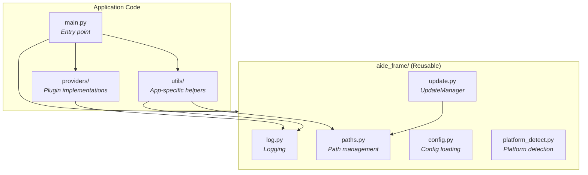

# AIDE Frame

Reusable application framework for Raspberry Pi projects.

AIDE Frame provides common infrastructure that can be used as a starting point for new Python applications:

- **Logging** - Centralized, configurable logging with systemd-friendly output
- **Path Management** - Base paths with extensible registration for app-specific paths
- **Configuration** - JSON config loading with deep merge and defaults support
- **Platform Detection** - Automatic detection of Raspberry Pi, WSL2, Linux desktop, etc.
- **Remote Updates** - GitHub-based update system with rollback support

## Architecture



## Dependency Rules

- `aide_frame/` modules are self-contained and reusable across projects
- Application code depends on `aide_frame/`, never the reverse
- The main entry point is the composition root - it wires everything together

## Usage

```python
from aide_frame import paths, log, config, platform_detect

# Initialize paths
paths.init()

# Register app-specific paths
paths.register("DOCS_DIR", os.path.join(paths.APP_DIR, "docs"))

# Use logging
from aide_frame.log import logger
logger.info("Application started")

# Load config with defaults
from aide_frame.config import load_config
cfg = load_config(search_paths=["config.json"], defaults=MY_DEFAULTS)

# Check platform
from aide_frame.platform_detect import PLATFORM
if PLATFORM == 'raspi':
    # Raspberry Pi specific code
    pass
```

