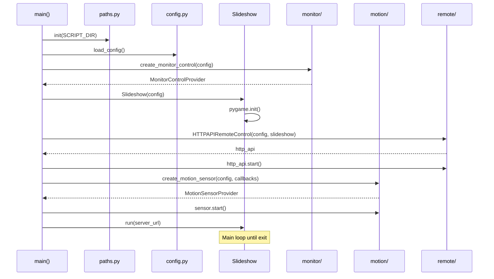
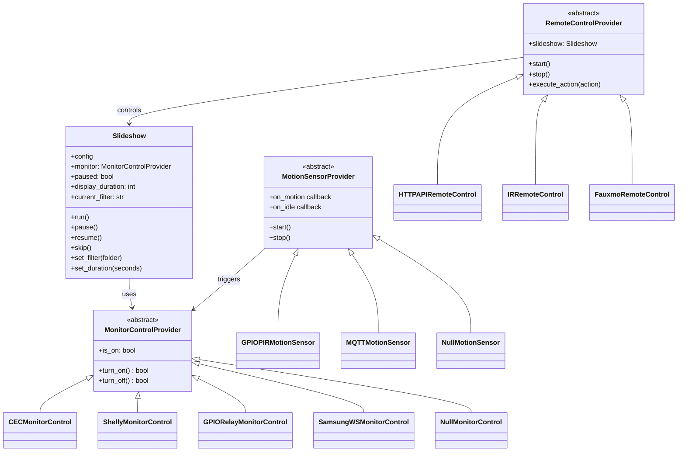

# Slideshow Core

**Module:** `slideshow.py`

Main entry point, startup flow, and display loop.

## Purpose

- Initialize pygame and display
- Load and display images with transitions
- Coordinate all providers (monitor, motion, remote control)
- Handle the main event loop

## Startup Flow



## Class Diagram



## Main Loop

```python
while running:
    # 1. Handle events (keyboard, quit)
    for event in pygame.event.get():
        if event.type == pygame.QUIT:
            running = False
        # ... handle keyboard

    # 2. Check if it's time to switch image
    if not paused and time_elapsed > display_duration:
        load_next_image()
        render_with_fade_transition()

    # 3. Update display
    pygame.display.flip()
    clock.tick(30)  # 30 FPS
```

## Image Loading

Images are loaded one at a time to minimize memory usage:

1. Get list of images (filtered by current folder if set)
2. Select random image from list
3. Load image with pygame
4. Scale to screen size (preserving aspect ratio)
5. Release previous image from memory
6. Display with fade transition

## Slideshow API

The Slideshow class exposes methods that are called by remote control providers:

| Method | Description |
|--------|-------------|
| `pause()` | Pause image rotation |
| `resume()` | Resume image rotation |
| `skip()` | Skip to next image immediately |
| `set_filter(folder)` | Only show images from specified folder |
| `clear_filter()` | Show all images |
| `set_duration(seconds)` | Set display duration per image |
| `get_status()` | Return current state as dict |

## Command Line Options

```bash
python3 slideshow.py --help

# Override image directory
python3 slideshow.py --image-dir myImages

# Set display duration
python3 slideshow.py --duration 5

# Force windowed or fullscreen
python3 slideshow.py --windowed
python3 slideshow.py --fullscreen

# Set window size
python3 slideshow.py --size 1920x1080

# Use specific config file
python3 slideshow.py --config ./my-config.json

# Set log level
python3 slideshow.py --log-level DEBUG
```

## Related Documentation

- [Monitor Control](monitor-control.md)
- [Motion Detection](motion-detection.md)
- [Web Control](web-control.md)
