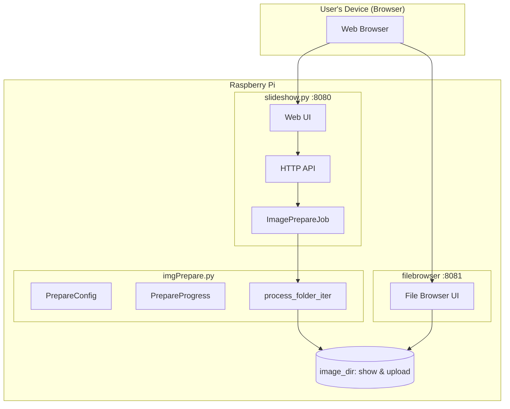

# Image Preparation

**Module:** `imgPrepare.py`

Resizing and optimizing images for display.

## Purpose

- Resize images to target display resolution
- Handle aspect ratio differences (crop, pad, or hybrid)
- Reduce memory usage during slideshow playback
- Support various image formats (JPEG, PNG, HEIC, AVIF)

## System Architecture



## Workflow

1. **Upload** raw images via filebrowser (`:8081`) to the uploads directory
2. **Prepare** images via the web UI (`:8080/prepare`)
3. **View** prepared images in the slideshow

## Web UI

Access the preparation UI at `http://raspberrypi:8080/prepare`

The web UI provides:
- Configuration form for all options
- Real-time progress bar
- Process/skip/error counts
- Cancel button for running jobs
- Link to filebrowser for uploading images

## API Endpoints

| Endpoint | Method | Description |
|----------|--------|-------------|
| `/prepare` | GET | Preparation web UI |
| `/api/prepare/status` | GET | Current job status |
| `/api/prepare/start` | POST | Start processing (JSON config) |
| `/api/prepare/cancel` | GET | Cancel running job |
| `/api/prepare/count?dir=PATH` | GET | Count images in directory |
| `/api/prepare/defaults` | GET | Default configuration |

### Start Job Example

```bash
curl -X POST http://raspberrypi:8080/api/prepare/start \
  -H "Content-Type: application/json" \
  -d '{
    "input_dir": "/home/pi/img/upload",
    "output_dir": "/home/pi/img/show",
    "mode": "hybrid-stretch",
    "target_size": "1920x1080",
    "skip_existing": true
  }'
```

## Resize Modes

| Mode | Description |
|------|-------------|
| `pad` | Add borders to fill target size (no cropping) |
| `crop` | Crop to fill target size (no borders) |
| `hybrid` | Crop up to limit, then pad remainder |
| `hybrid-stretch` | Crop, stretch slightly, then pad (default) |

## Configuration Options

| Option | Default | Description |
|--------|---------|-------------|
| `mode` | `hybrid-stretch` | Resize mode |
| `size` | `1920x1080` | Target resolution (WxH) |
| `pad-mode` | `average` | Padding color: gray, white, black, average |
| `crop-min` | `0.8` | Minimum image retention when cropping |
| `stretch-max` | `0.2` | Maximum stretch factor |
| `no-stretch-limit` | `0.4` | Aspect deviation limit for stretching |
| `text` | off | Overlay filename on image |
| `no-skip` | off | Reprocess existing files |
| `dry-run` | off | Preview only, no changes |
| `flatten` | off | All output to root (vs preserve structure) |

## Memory Management

| State | Memory Impact |
|-------|---------------|
| **Module not used** | No PIL loaded, minimal overhead |
| **During processing** | ~36MB per large image (4000x3000), released after each |
| **GC Strategy** | Explicit `img.close()` + `del` + periodic `gc.collect()` |

## Image Organization

Organize images in subfolders for filtering:

```
/home/pi/img/show
├── vacation/
│   ├── beach_2024/
│   └── mountains/
├── family/
│   ├── birthdays/
│   └── holidays/
└── nature/
```

Use the web UI or IR remote to filter by folder.

## Welcome Screen

On startup, the slideshow displays a welcome screen for 20 seconds showing:
- A QR code linking to the web control UI
- The URL in text form
- Instructions for the user

**Requirements:**
```bash
pip install "qrcode[pil]"
```

If the library is not installed, the welcome screen is skipped.

**Cache location:** `app/.welcome_cache/`

The welcome image is regenerated automatically when the server URL changes.
