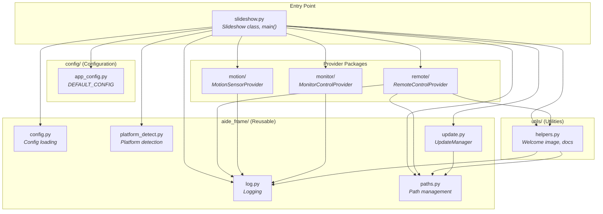

# Application Components

Overview of slideshow-specific modules and their responsibilities.

## Code Structure

```
app/
├── slideshow.py          # Main entry point, Slideshow class, pygame loop
├── imgPrepare.py         # Image preprocessing utilities
├── VERSION               # Current version number
│
├── aide_frame/           # Reusable application framework
│   ├── __init__.py
│   ├── log.py            # Centralized logging
│   ├── paths.py          # Path management with register()
│   ├── config.py         # Configuration loading
│   ├── platform_detect.py # Platform detection (raspi/wsl2/linux/etc.)
│   └── update.py         # GitHub-based remote updates
│
├── config/               # Application configuration
│   ├── __init__.py
│   └── app_config.py     # DEFAULT_CONFIG for slideshow
│
├── utils/                # Application-specific utilities
│   ├── __init__.py
│   └── helpers.py        # Welcome image, docs, path security
│
├── monitor/              # Monitor power control providers
├── motion/               # Motion detection providers
├── remote/               # Remote control input providers
├── static/               # Web UI files
├── docs/                 # Documentation files
└── sample_images/        # Demo images for first run
```

**Entry point:** `python3 app/slideshow.py`

## Module Dependencies



**Dependency rules:**
- `aide_frame/` modules are self-contained and reusable across projects
- `utils/` contains application-specific code that depends on `aide_frame/`
- Provider packages depend only on `aide_frame.log` (and `paths`/`helpers` for http_api)
- `slideshow.py` is the composition root - it wires everything together

## Key Design Principles

| Principle | Description |
|-----------|-------------|
| **Framework Separation** | Generic infrastructure (`aide_frame/`) is separated from app-specific code (`utils/`) |
| **Plugin Architecture** | Each concern (monitor, motion, remote) has an abstract base class with multiple provider implementations |
| **Lazy Loading** | Heavy dependencies (PIL, fauxmo, etc.) are only imported when needed |
| **Platform Abstraction** | Hardware-specific code gracefully falls back to no-ops on unsupported platforms |
| **Centralized Logging** | All modules use `from aide_frame.log import logger` for consistent output |
