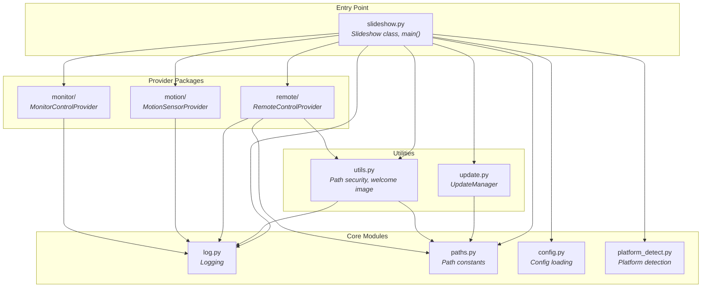

# Implementation

Software architecture and module dependencies.

## Code Structure

```
app/
├── slideshow.py          # Main entry point, Slideshow class, pygame loop
├── config.py             # Configuration loading and defaults
├── paths.py              # Centralized path constants
├── platform_detect.py    # Platform detection (raspi/wsl2/linux/macos/windows)
├── log.py                # Centralized logging
├── update.py             # UpdateManager for remote updates
├── utils.py              # Utilities: path security, welcome image
├── VERSION               # Current version number
│
├── monitor/              # Monitor power control providers
├── motion/               # Motion detection providers
├── remote/               # Remote control input providers
├── static/               # Web UI files
├── docs/                 # Documentation files
└── sample_images/        # Demo images for first run
```

**Entry point:** `python3 app/slideshow.py`

## Module Dependencies



**Dependency rules:**
- `log.py` and `paths.py` have no local dependencies (foundation modules)
- Provider packages depend only on `log` (and `paths`/`utils` for http_api)
- `slideshow.py` is the composition root - it wires everything together

## Key Design Principles

| Principle | Description |
|-----------|-------------|
| **Plugin Architecture** | Each concern (monitor, motion, remote) has an abstract base class with multiple provider implementations |
| **Lazy Loading** | Heavy dependencies (PIL, fauxmo, etc.) are only imported when needed |
| **Platform Abstraction** | Hardware-specific code gracefully falls back to no-ops on unsupported platforms |
| **Centralized Logging** | All modules use `from log import logger` for consistent output |

## Components

### Technical Components (Reusable)

These modules are application-independent and could be reused in other projects:

| Component | Documentation |
|-----------|---------------|
| Platform Detection | [technical/platform-detect.md](technical/platform-detect.md) |
| Logging | [technical/logging.md](technical/logging.md) |
| Configuration | [technical/config.md](technical/config.md) |
| Documentation Viewer | [technical/docs-viewer.md](technical/docs-viewer.md) |

### Slideshow Components (Domain-Specific)

These modules implement the slideshow functionality:

| Component | Documentation |
|-----------|---------------|
| Slideshow Core | [slideshow/core.md](slideshow/core.md) |
| Monitor Control | [slideshow/monitor-control.md](slideshow/monitor-control.md) |
| Motion Detection | [slideshow/motion-detection.md](slideshow/motion-detection.md) |
| Web Control | [slideshow/web-control.md](slideshow/web-control.md) |
| IR Remote | [slideshow/ir-remote.md](slideshow/ir-remote.md) |
| Alexa Voice Control | [slideshow/alexa.md](slideshow/alexa.md) |
| Image Preparation | [slideshow/image-prepare.md](slideshow/image-prepare.md) |
