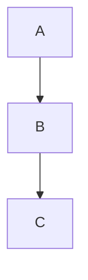

# Documentation Viewer

The project includes a built-in documentation viewer accessible via the web UI at `/about`.

## Purpose

- Display project documentation without leaving the web interface
- Support Markdown rendering with tables, code blocks, and diagrams
- Provide automatic navigation between documentation files
- Extract titles and descriptions from documents for the navigation

## Architecture

```
┌─────────────────────────────────────────────────────────────┐
│  Browser                                                     │
│  ┌─────────────────────────────────────────────────────────┐│
│  │  about.html                                              ││
│  │  - Dynamic sidebar (auto-generated from /api/docs/structure)│
│  │  - Hover tooltips with document descriptions             ││
│  │  - Markdown rendering (marked.js)                        ││
│  │  - Mermaid diagram support                               ││
│  │  - Table of Contents generation                          ││
│  │  - Breadcrumb navigation                                 ││
│  └─────────────────────────────────────────────────────────┘│
└─────────────────────────────────────────────────────────────┘
                              │
                              ▼
┌─────────────────────────────────────────────────────────────┐
│  slideshow.py :8080                                          │
│  ┌─────────────────────────────────────────────────────────┐│
│  │  http_api.py                                             ││
│  │  - GET /api/docs           → list_docs()                 ││
│  │  - GET /api/docs/structure → get_docs_structure()        ││
│  │  - GET /api/docs/{path}    → load_doc()                  ││
│  └─────────────────────────────────────────────────────────┘│
│  ┌─────────────────────────────────────────────────────────┐│
│  │  utils.py                                                ││
│  │  - list_docs()                    → scan docs/ directory ││
│  │  - load_doc()                     → read markdown file   ││
│  │  - extract_title_and_description()→ parse H1 + 1st sentence│
│  │  - get_docs_structure()           → sections with titles ││
│  └─────────────────────────────────────────────────────────┘│
└─────────────────────────────────────────────────────────────┘
                              │
                              ▼
┌─────────────────────────────────────────────────────────────┐
│  app/docs/                                                   │
│  ├── index.md                                                │
│  ├── requirements/                                           │
│  ├── platform/                                               │
│  ├── implementation/                                         │
│  │   ├── technical/                                          │
│  │   └── slideshow/                                          │
│  ├── deployment/                                             │
│  └── development/                                            │
└─────────────────────────────────────────────────────────────┘
```

## API Endpoints

| Endpoint | Description |
|----------|-------------|
| `GET /api/docs` | List all available documentation files (flat list) |
| `GET /api/docs/structure` | Get structured navigation with sections, titles, and descriptions |
| `GET /api/docs/{path}` | Load a specific markdown file |
| `GET /readme` | Load README.md (legacy, for compatibility) |

### Example: /api/docs/structure

```bash
curl http://localhost:8080/api/docs/structure
```

```json
{
  "sections": [
    {
      "name": "Overview",
      "docs": [
        {
          "path": "index.md",
          "title": "AIDE - Slideshow",
          "description": "A modular fullscreen photo slideshow with a plugin architecture."
        }
      ]
    },
    {
      "name": "Platform",
      "docs": [
        {"path": "platform/index.md", "title": "Platform", "description": "..."},
        {"path": "platform/hardware.md", "title": "Hardware"}
      ]
    }
  ]
}
```

## Automatic Navigation

The sidebar is **automatically generated** from the `docs/` directory structure. No manual updates to `about.html` are needed when adding new documents.

### Section Order

Sections are displayed in this fixed order:

1. **Overview** - `docs/index.md`
2. **Requirements** - `docs/requirements/*.md`
3. **Platform** - `docs/platform/*.md`
4. **Implementation Technical** - `docs/implementation/index.md` + `docs/implementation/technical/*.md`
5. **Implementation Application** - `docs/implementation/slideshow/*.md`
6. **Deployment** - `docs/deployment/*.md`
7. **Development** - `docs/development/*.md`

Within each section, `index.md` files appear first, then other files are sorted alphabetically.

### Title and Description Extraction

For each markdown file:

- **Title**: Extracted from the first `# Heading` (H1)
- **Description**: Extracted from the first complete sentence after the H1

The description appears as a hover tooltip in the sidebar navigation.

```markdown
# My Document Title

This is the first sentence that becomes the description. More text follows...
```

## Security

**Path traversal protection:** The `load_doc()` function blocks paths containing `..` and verifies the resolved path stays within the docs directory.

```python
def load_doc(filename):
    if '..' in filename:
        return None  # Blocked
    # Verify resolved path is within DOCS_DIR
    real_path = os.path.realpath(filepath)
    if not real_path.startswith(real_docs + os.sep):
        return None  # Blocked
```

## Web UI Features

### Dynamic Sidebar

- Auto-generated from `/api/docs/structure`
- Hover over links to see document descriptions
- Active link highlighting
- Mobile-friendly with toggle button

### Table of Contents

Each document shows an auto-generated TOC:

- Collapsible header
- Smooth scrolling to sections
- Updates URL hash for linking

### Markdown Support

- GitHub-flavored Markdown (tables, code blocks, task lists)
- Syntax highlighting for code blocks
- Automatic heading IDs for linking

### Mermaid Diagrams

````markdown

````

Supported diagram types: `flowchart`, `sequenceDiagram`, `classDiagram`

### Navigation Features

- **Sidebar:** Dynamic navigation to all documents
- **Breadcrumbs:** Shows current location in hierarchy
- **Deep links:** Direct URL via `?doc=` parameter
- **Link interception:** `.md` links load via JavaScript

```
http://raspberrypi:8080/about?doc=implementation/slideshow/core.md
```

## Adding Documentation

1. Create a new `.md` file in the appropriate directory under `app/docs/`
2. Add a `# Title` as the first line
3. Write a descriptive first sentence (shown in hover tooltip)
4. **No need to update `about.html`** - the sidebar updates automatically

To add a new section or change section order, modify `section_defs` in `utils.py:get_docs_structure()`.

## Files

| File | Purpose |
|------|---------|
| `paths.py` | Defines `DOCS_DIR` pointing to `app/docs/` |
| `utils.py` | `list_docs()`, `load_doc()`, `extract_title_and_description()`, `get_docs_structure()` |
| `http_api.py` | Serves `/api/docs`, `/api/docs/structure`, `/api/docs/{path}` |
| `about.html` | Web UI with dynamic sidebar, TOC, breadcrumbs, markdown rendering |
