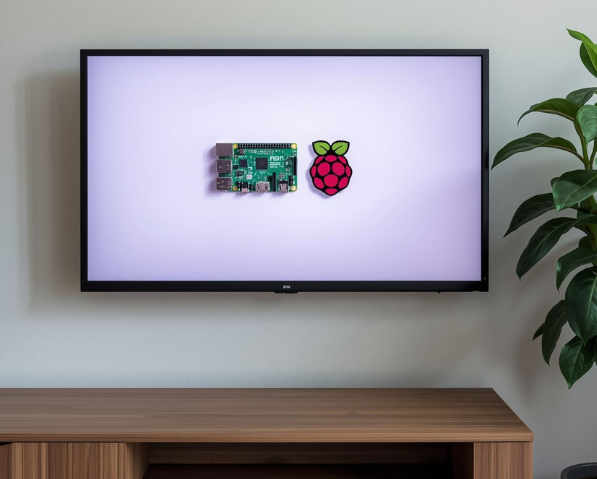

# AIDE - Slideshow

A modular fullscreen photo slideshow with a plugin architecture for different hardware setups.

Designed to run on a *Raspberry Zero* connected to a wall mounted display.

This project is part of [AIDE examples](https://github.com/aide-examples) - a series of applications built almost completely with agentic coding.

AIDE Slideshow contains a set of modules - *aide-frame* - which might be re-used in a different project.

---

## Navigation

Use the sidebar on the left to browse the documentation. Hover over any link to see a description.

The documentation is organized into these sections:

- **Requirements** - Feature list from the user's perspective
- **Platform** - Hardware selection, dependencies, and system setup
- **Application Components** - Slideshow-specific modules (monitor control, motion detection, image preparation, ..)
- **Framework Components** - Reusable components (config, logging, platform detection)
- **Deployment** - Installation, read-only filesystem, remote updates
- **Development** - Testing, extending, troubleshooting
