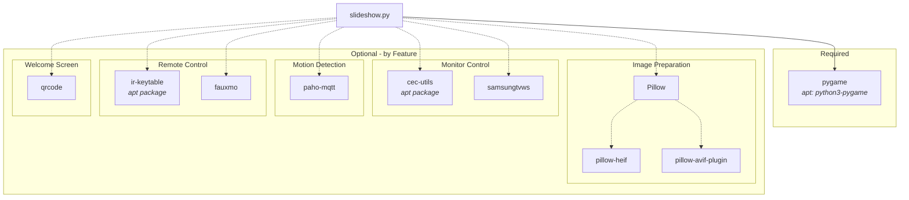

# Dependencies

System packages and Python libraries.

## System Packages

```bash
sudo apt update
sudo apt install python3-pygame
```

### Optional System Packages

| Package | Purpose |
|---------|---------|
| `cec-utils` | HDMI-CEC monitor control |
| `ir-keytable` | IR remote control |

```bash
# For CEC support
sudo apt install cec-utils

# For IR remote
sudo apt install ir-keytable
```

## Python Packages

The core slideshow requires only `pygame` which is installed via apt.

### Optional Python Packages

| Package | Purpose | Install |
|---------|---------|---------|
| `Pillow` | Image preparation | `pip install Pillow` |
| `pillow-heif` | HEIC/HEIF support (iPhone photos) | `pip install pillow-heif` |
| `pillow-avif-plugin` | AVIF support | `pip install pillow-avif-plugin` |
| `samsungtvws` | Samsung TV control | `pip install samsungtvws` |
| `paho-mqtt` | MQTT motion sensor | `pip install paho-mqtt` |
| `qrcode` | Welcome screen QR code | `pip install "qrcode[pil]"` |
| `fauxmo` | Alexa voice control | `pip install fauxmo` |

### System-wide Installation (without venv)

On Raspberry Pi or Debian/Ubuntu, you can install Python packages via apt:

```bash
sudo apt install python3-pil python3-qrcode
```

This avoids the need for a virtual environment and integrates better with system packages.

## External Tools

### Filebrowser

For web-based file management, we recommend installing [Filebrowser](https://filebrowser.org/):

```bash
# Download and install
curl -fsSL https://raw.githubusercontent.com/filebrowser/get/master/get.sh | bash

# Run on port 8081
filebrowser -r /home/pi/img -p 8081
```

This provides a separate web UI for uploading and managing images.

## Dependency Graph



**Legend:** Solid lines = required, dashed lines = optional
